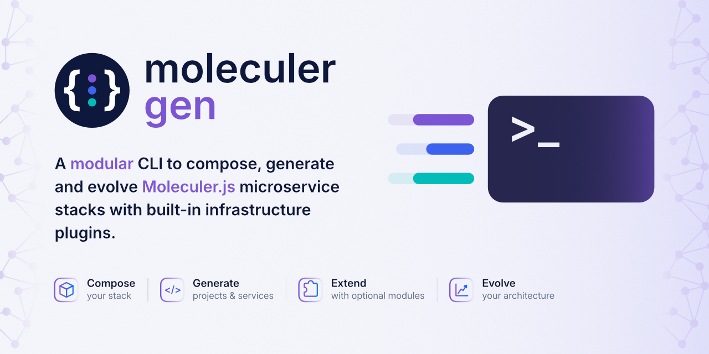
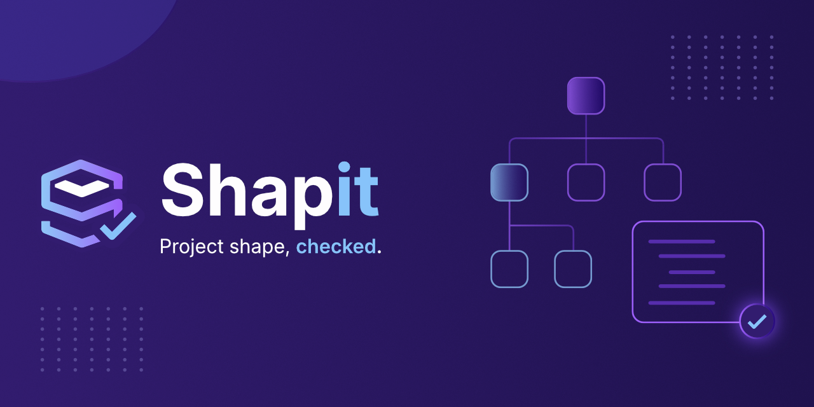
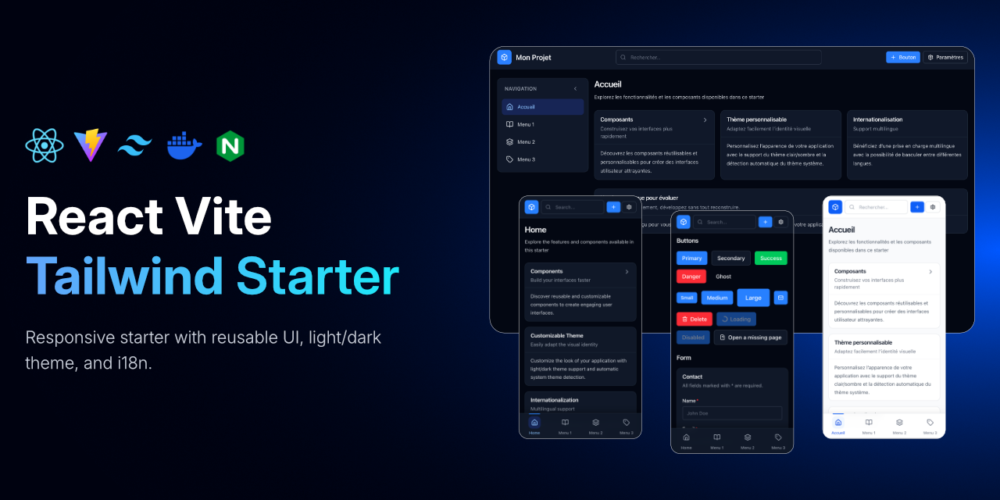

# Hi, I'm Mélissa 🐡

**Developer tooling · Platform engineering · Distributed systems**

I enjoy building reusable tooling that standardizes how projects are created, extended and maintained, with a particular interest in microservices and developer experience.

## What I'm building

### [`moleculer-gen`](https://github.com/AssilemSDN/moleculer-gen)

A lightweight platform engineering CLI to scaffold, extend and maintain Moleculer.js microservice projects.

### [`shapit`](https://github.com/AssilemSDN/shapit)

A TypeScript CLI for defining and validating the expected structure of a project.

### [`react-vite-tailwind-starter`](https://github.com/AssilemSDN/react-vite-tailwind-starter)

A reusable frontend starter with a pragmatic set of conventions for building React applications.

## Toolbox

**Platform & Backend**
Node.js · Docker · Docker Compose · Moleculer.js · Spring Boot

**Languages**
TypeScript · JavaScript · Java

**Frontend**
React · Vite · Tailwind CSS

**Infrastructure & Services**
Traefik · Prometheus · NATS · MongoDB · Keycloak

## Currently

Working mostly on developer tooling, project automation, and improving [`moleculer-gen`](https://github.com/AssilemSDN/moleculer-gen).
